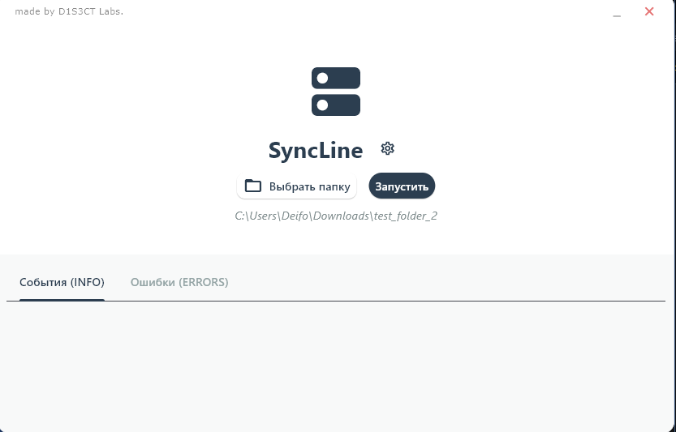

# SyncLine

**SyncLine** — это легковесное десктопное приложение для автоматической синхронизации локальных папок с облачным хранилищем Яндекс.Диск в режиме реального времени.



## Стек технологий
* **Язык:** Python 3.13
* **GUI Фреймворк:** [Flet](https://flet.dev/) (Flutter для Python)
* **API Облака:** [Yadisk Python](https://github.com/ivbeg/yadisk.py)
* **Мониторинг файлов:** [Watchdog](https://pypi.org/project/watchdog/)
* **Системный трей:** [Pystray](https://pypi.org/project/pystray/)
* **Сборка:** PyInstaller

## Основные функции
* **Авто-синхронизация:** Программа мгновенно обнаруживает изменения в выбранной папке и загружает новые/измененные файлы в облако.
* **Работа в фоне:** Приложение сворачивается в системный трей и продолжает работу, не мешая пользователю.
* **Логирование событий:** Встроенное окно мониторинга отображает текущий статус синхронизации и ошибки в реальном времени.
* **Автономность:** Собранная версия не требует установленного интерпретатора Python.

## Инструкция по установке и запуску

### Для пользователей (EXE)
1. Перейдите в папку `dist/SyncLine`.
2. Запустите файл `SyncLine.exe`.
3. При первом запуске укажите путь к локальной папке и введите ваш токен Яндекс.Диска

### Для разработчиков
1. Клонируйте репозиторий.
2. Создайте виртуальное окружение:
   ```bash
   python -m venv .venv
   source .venv/Scripts/activate
   ```
3. Установите зависимости
```bash
pip install flet yadisk watchdog pystray
```
4. Запустите проект 
```bash
python main.py
```
### 🛠 Сборка в EXE
Для создания переносимой версии использовался скрипт на базе PyInstaller, учитывающий специфику старых версий Flet:

```bash
python build_folder.py
```
___
## ⚖️ Правовая информация
Данный проект и весь исходный код являются собственностью **D1S3CT Labs**. 
Все права защищены. Использование, копирование или распространение материалов допускается только с разрешения правообладателя.
